## Изучите [README.md](README.md) файл и структуру проекта.

## Задание 1

1. Спроектируйте to be архитектуру КиноБездны, разделив всю систему на отдельные домены и организовав интеграционное взаимодействие и единую точку вызова сервисов.
   Результат представьте в виде контейнерной диаграммы в нотации С4.
   Добавьте ссылку на файл в этот шаблон
   [ссылка на файл](docs/c4/container/to-be/to-be-container.puml)

## Задание 2

### 1. Proxy

DONE

### 2. Kafka

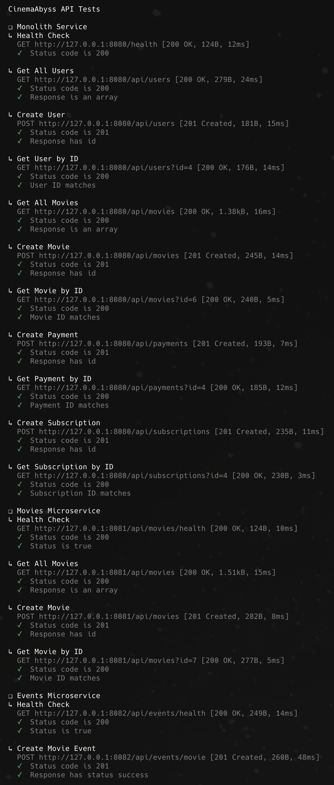
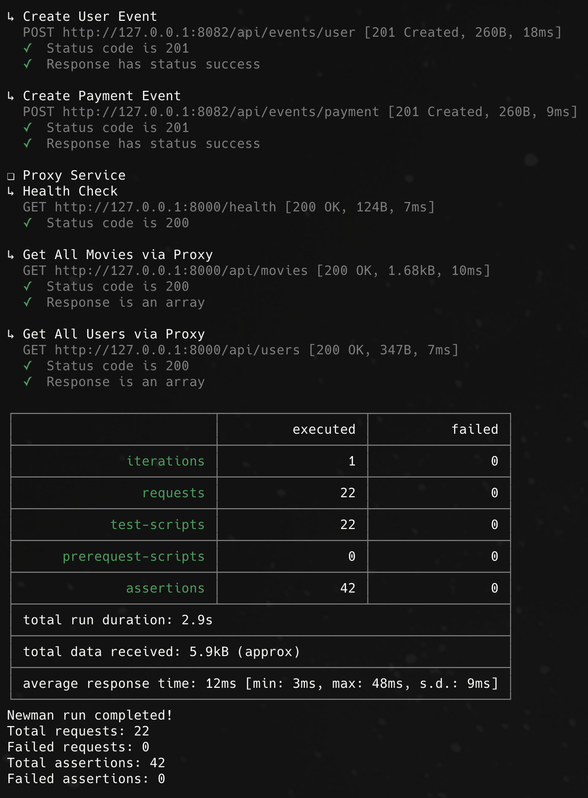
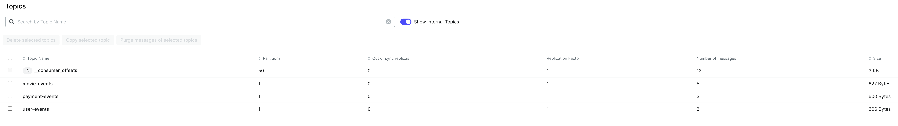

## Задание 3

Команда начала переезд в Kubernetes для лучшего масштабирования и повышения надежности.
Вам, как архитектору осталось самое сложное:

- реализовать CI/CD для сборки прокси сервиса
- реализовать необходимые конфигурационные файлы для переключения трафика.

### CI/CD

DONE

### Proxy в Kubernetes

#### Шаг 1

DONE

#### Шаг 2

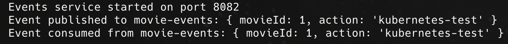
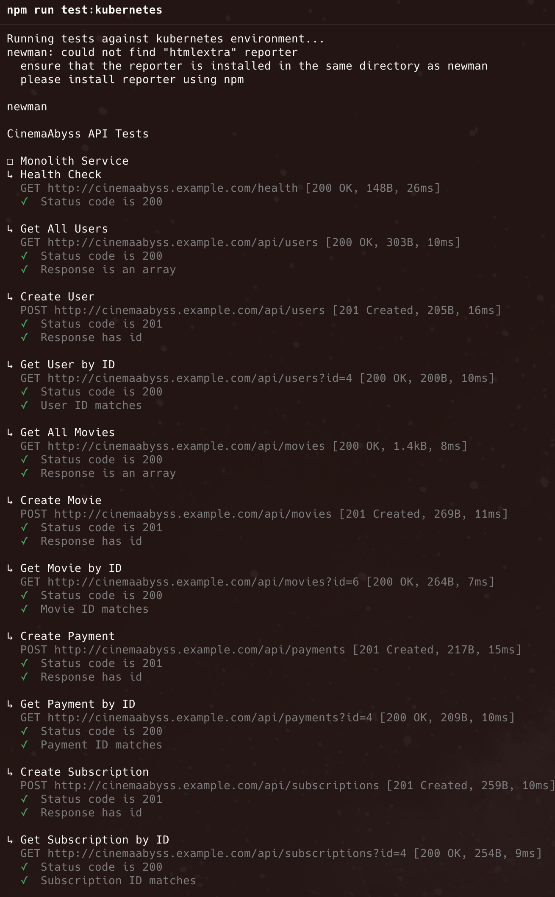
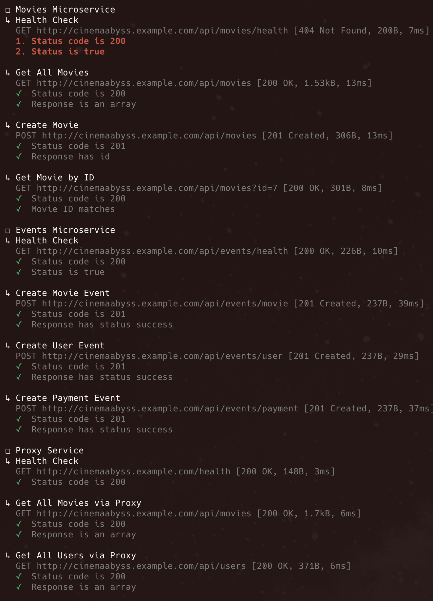
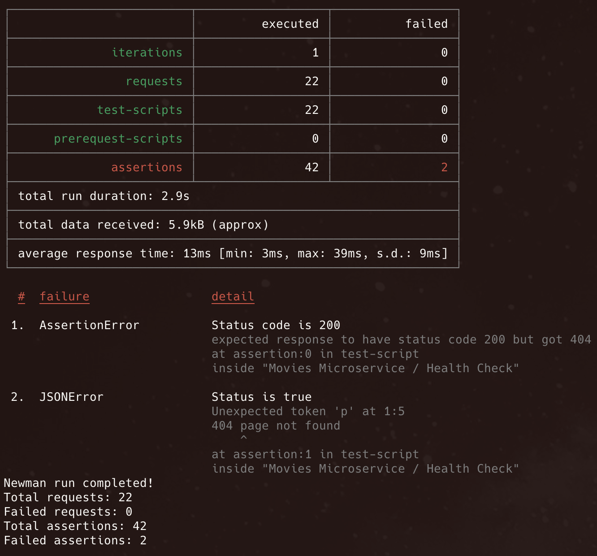

#### Шаг 3

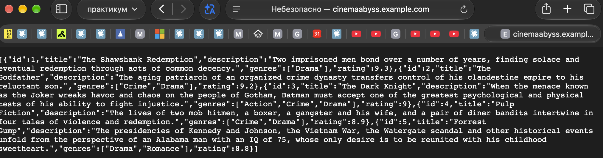
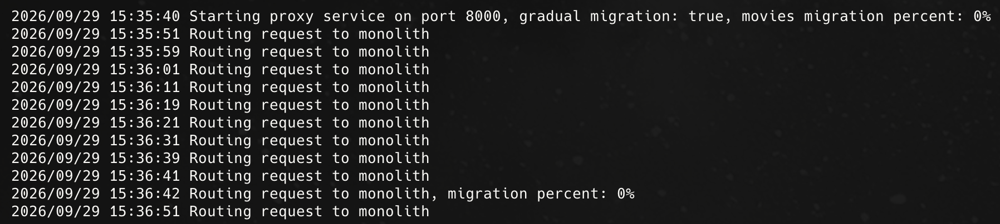

## Задание 4

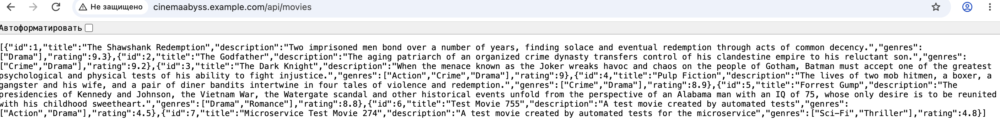
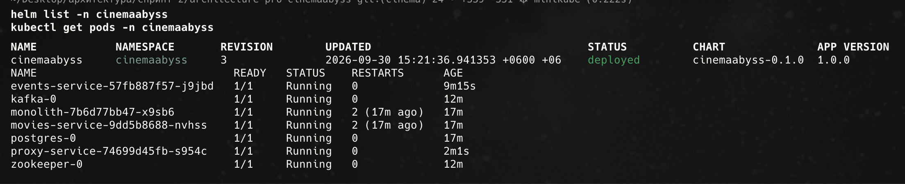

# Задание 5

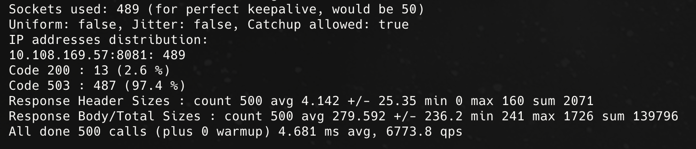
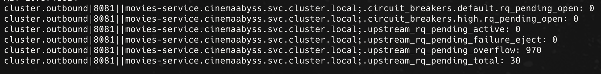
